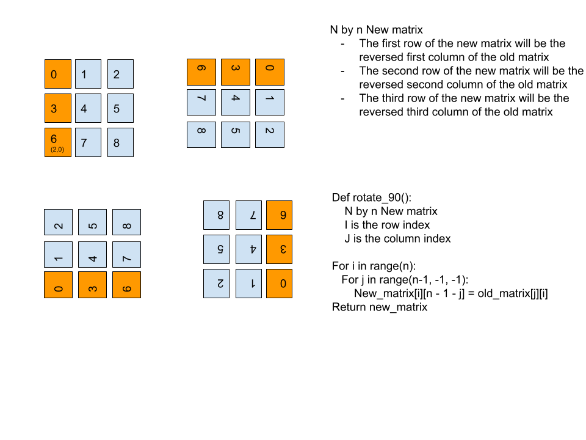

# [1886. Determine Whether Matrix Can Be Obtained By Rotation](https://leetcode.com/contest/weekly-contest-244/problems/determine-whether-matrix-can-be-obtained-by-rotation/)

## Explanation
See 

## Code
```cpp
class Solution {
public:
    vector<vector<int>> rotation_90(vector<vector<int>>old_mat) {
        const int n = old_mat.size();
        vector<vector<int>> new_mat(n, vector<int>(n, 0));
        // new_mat = [[0]*n for _ in range(n)]
        for (int i = 0; i < n; ++i) {
            for (int j = n - 1; j >= 0; --j) {
                new_mat[i][n - 1 - j] = old_mat[j][i];
            }
        }
        return new_mat;
    }
    // this is for debug
    void print(vector<vector<int>>& a){
        for (auto x: a){
            for (auto c: x) cout<<c<<" ";
            cout<<endl;
        }
    }
    bool findRotation(vector<vector<int>>& mat, vector<vector<int>>& target) {
        const int n = mat.size();
        if (n == 0) return true;
        if (mat == target) return true;
        for (int r = 0; r < 4; ++r) {
            
            mat = rotation_90(mat);
            //cout<<r<<endl;
            print(mat);
            if (mat == target) return true;
        }
        return false;  
    }
};
```
